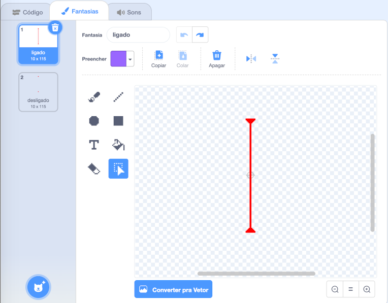

## Lasers!

Para seu jogo ficar um pouco mais difícil de completar, você vai adicionar lasers!

--- task ---

Adicione um novo ator ao seu jogo e chame-o de `laser`. Deve ter duas fantasias: uma chamada "ligado" e outra chamada "desligado".




--- /task ---

--- task ---

Coloque seu novo ator laser entre duas plataformas.


--- /task ---

--- task ---

Adicione código ao seu ator laser para fazer que ele alterne entre suas duas fantasias.


```blocks3
    when flag clicked
	  forever
      switch costume to (ligado v)
      wait (2) seconds
      switch costume to (desligado v)
      wait (2) seconds
	  end
```

Se você preferir, você pode alterar o código mostrado acima para que o ator possa `esperar`{:class="block3control"} um intervalo de tempo `aleatório`{:class="block3operators"} entre as trocas de fantasia.

--- /task ---

--- task ---

Finalmente, adicione código ao seu ator laser para que transmita a mensagem 'atingido' quando o ator laser tocar no ator personagem.

--- hints ---


--- hint ---

Este código deve ser muito parecido com o código que você adicionou ao seu ator bola.

--- /hint ---

--- hint ---

Copie o código que você adicionou ao ator bola para fazer com que este ator `transmita 'atingido'`{:class="block3control"} quando ele estiver `tocando seu personagem`{:class="block3sensing"}.

--- /hint ---

--- hint ---

Este é o código que você deve adicionar:


```blocks3
when green flag clicked
forever 
  if <touching (Pico walking v) ?> then 
    broadcast (atingido v)
  end
end
```

--- /hint ---

--- /hints ---

Você não precisa adicionar nenhum código extra aos seus atores personagens, porque o ator personagem já sabe o que fazer quando recebe o `transmita 'atingido'`{:class="block3control"}!

--- /task ---

--- task ---

Teste seu jogo para ver se você consegue mover o personagem para além do laser. Se o laser for muito fácil ou muito difícil de evitar, altere o tempo de `espere`{:class="block3control"} no código para o ator laser.

--- /task ---