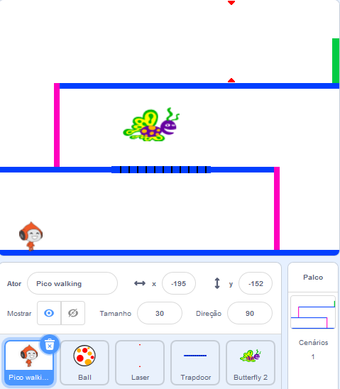

## Desafio: mais obstáculos

Se você acha que seu jogo ainda é fácil demais, você pode adicionar mais obstáculos. Os obstáculos podem ser o que você quiser! Aqui estão algumas idéias:

+ Uma borboleta perigosa
+ Plataformas que aparecem e desaparecem
+ Bolas de tênis caindo que devem ser evitadas



Você pode até desenhar outro plano de fundo para criar o próximo nível. Em seguida, adicione código para que, quando seu personagem chegar na porta verde, o jogo mude para o novo plano de fundo:


```blocks3
    sif <touching color [#00FF00]?> then
		switch backdrop to (next backdrop v)
		go to x: (-210) y: (-120)
		wait (1) seconds
	end
```