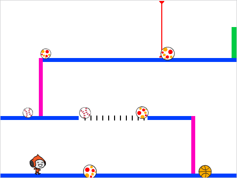

\--- no-print \---

Aceasta este versiunea **Scratch 3** a proiectului. Există, de asemenea, o versiune de [Scratch 2 a proiectului](https://projects.raspberrypi.org/en/projects/dodgeball-scratch2).

\--- /no-print \---

## Introducere

Veți învăța cum să creezi un joc în care jucătorul trebuie să evite mingile în mișcare pentru a ajunge la sfârșitul nivelului.

\--- no-print \---

Faceți clic pe steagul verde pentru a începe, apoi utilizați tastele săgeată pentru a vă deplasa și tasta <kbd>spațiu</kbd> pentru a sari.

  <iframe allowtransparency="true" width="485" height="402" src="https://scratch.mit.edu/projects/embed/251809924/?autostart=false" frameborder="0" scrolling="no"></iframe>
  

\--- /no-print \---

\--- print-only \---

\--- /print-only \---

## \--- collapse \---

## title: What you will need

### Dispozitive

+ Un computer capabil de a rula Scratch 3

### Software

+ Scratch 3 (fie[online](https://scratch.mit.edu/projects/editor/) fie [offline](https://scratch.mit.edu/download/))

### Descărcări

You can [find the downloads here](http://rpf.io/p/en/dodgeball-go).

\--- /collapse \---

## \--- collapse \---

## title: What you will learn

+ Cum se utilizează tastatura pentru a controla o sprite
+ Cum se folosește `dacă, atunci, altceva`{: class = "block3control"} Blocaj Scratch
+ Cum de a clona un sprite

\--- /collapse \---

## \--- collapse \---

## title: Additional notes for educators

\--- no-print \---

If you need to print this project, please use the [printer-friendly version](https://projects.raspberrypi.org/en/projects/dodgeball/print){:target="_blank"}.

\--- /no-print \---

You can find the [completed project here](http://rpf.io/p/en/dodgeball-get).

\--- /collapse \---