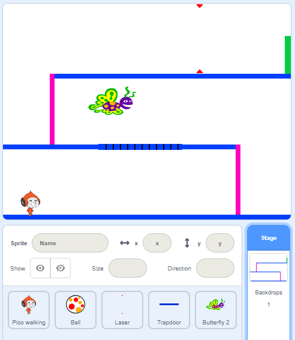

## Provocarea: Mai multe obstacole

Dacă credeți că jocul dvs. este încă prea ușor, puteți adăuga mai multe obstacole în calea acestuia. Obstacolele pot fi orice îți place! Iată câteva idei:

+ Un fluture periculos
+ Platforme care apar și dispar
+ Mingii de tenis care cad si care trebuiesc evitate



Puteți crea chiar și un alt fundal pentru a crea nivelul următor. Apoi adăugați codul astfel încât, atunci când personajul tău atinge ușa verde, jocul trece la noul fundal:


```blocks3
    dacă <touching color [#00FF00]?> atunci
        fundal comutator la (următorul fundal v)
        mergeți la x: (-210) y: (-120)
        așteptați (1) secunde
    sfârșit
```