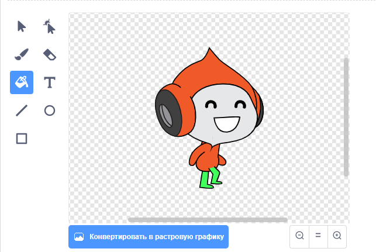

## Задание: улучшить гравитацию

В игре есть ещё одна маленькая ошибка: гравитация не тянет спрайт персонажа вниз, если **любая** часть спрайта касается синей платформы. Таким образом, даже если голова спрайта касается платформы, спрайт не падает! Ты можешь проверить это сам: сделай так, чтобы твой персонаж поднялся по лестнице большую часть пути, а затем перемести персонаж под платформу:


Чтобы исправить ошибку, сначала нужно дать спрайту персонажа новые брюки другого цвета ( **все** костюмы).



Затем замени этот блок кода:

```blocks3
    < touching color [#0000FF]? >
```

этим блоком кода:

```blocks3
    < color [#00FF00] is touching [#0000FF]? >
```

Чтобы убедиться, что ошибка исправлена, протестируй игру после внесения этих изменений!