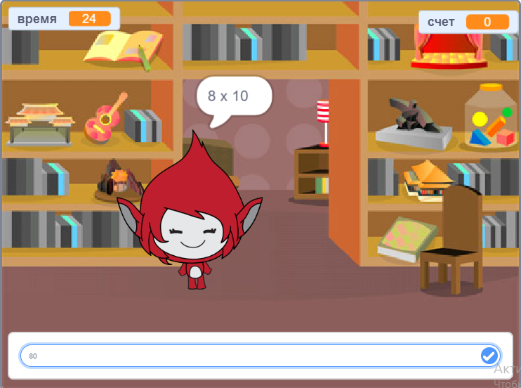

## Что дальше?

Попробуй проект [Игра для мозга](https://projects.raspberrypi.org/en/projects/brain-game?utm_source=pathway&utm_medium=whatnext&utm_campaign=projects), где ты создашь свою викторину по математике.

\--- no-print \---

Нажмите кнопку, чтобы начать. Введи ответ на вопрос и нажми клавишу <kbd>Enter</kbd>.

  <iframe allowtransparency="true" width="485" height="402" src="https://scratch.mit.edu/projects/embed/250234955/?autostart=false" frameborder="0" scrolling="no"></iframe>
  

\--- /no-print \---

\--- print-only \---

\--- /print-only \---