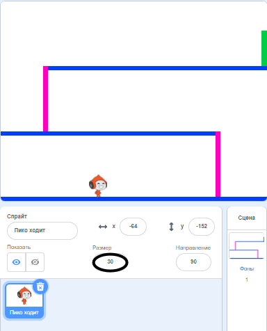
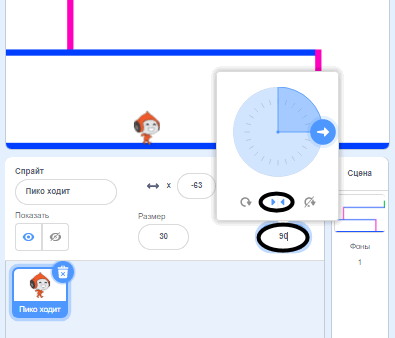

## Движение персонажа

Начнём с создания персонажа, который может двигаться влево и вправо и подниматься по лестнице.

\--- task \---

Открой стартовый проект Scratch "Вышибалы".

**Онлайн:** открой стартовый проект по адресу [rpf.io/dodgeball-on](http://rpf.io/dodgeball-on){:target="_blank"}.

Если у тебя есть учетная запись в Scratch, то ты можешь сделать копию, нажав **Ремикс**.

**Оффлайн:** скачай стартовый проект с [rpf.io/p/en/dodgeball-get](http://rpf.io/p/en/dodgeball-get){:target="_blank"} и затем открой его с помощью оффлайн редактора.

\--- /task \---

Проект содержит фон с платформами:


\--- task \---

Выбери новый спрайт в качестве персонажа, которым будет управлять игрок, и добавь его в свой проект. Будет круто, если ты выберешь спрайт с несколькими костюмами, тогда будет похоже на то, что он двигается.


[[[generic-scratch3-sprite-from-library]]]

\--- /task \---

\--- task \---

Добавь блоки кода к спрайту персонажа так, чтобы игрок мог использовать клавиши со стрелками, чтобы управлять персонажем. Когда игрок нажимает стрелку вправо, персонаж должен повернуться вправо, сделать несколько шагов и поменять костюм:


```blocks3
когда щёлкнут по зелёному флагу
повторять всегда 
  если  клавиша (правая стрелка v) нажата? >, то 
    повернуться в направлении (90 v)
    идти (3) шагов
    следующий костюм
  конец
конец
```

\--- /task \---

\--- task \---

Если это необходимо, отрегулируй размер спрайта.



\--- /task \---

\--- task \---

Проверь своего персонажа: нажми на флаг, а затем удерживай нажатой клавишу со стрелкой вправо. Он передвинулся вправо? Похоже на то, что он ходит?


\--- /task \---

\--- task \---

Добавь блоки кода в цикл `повторять всегда ` {:class="block3control"} спрайта персонажа, чтобы он двигался влево при нажатии клавиши со стрелкой влево.

\--- hints \---

\--- hint \---

Чтобы твой персонаж мог двигаться влево, тебе нужно добавить еще один блок `если`{:class="block3control"} в цикл `повторять всегда`{:class="block3control"}. В новый блок `если`{:class="block3control"}, добавь код, чтобы спрайт персонажа `двигался`{:class="block3motion"} влево.

\--- /hint \---

\--- hint \---

Скопируй код, который ты только что создал, чтобы персонаж шёл вправо. Затем установи `клавиша нажата`{:class="block3sensing"} на `стрелку влево`{:class="block3sensing"} и измени `направление`{:class="block3motion"} на `-90`.

```blocks3
if <key (right arrow v) pressed? > then
    point in direction (90 v)
    move (3) steps
    next costume
end
```

\--- /hint \---

\--- hint \---

Твой код должен выглядеть так:


```blocks3
when green flag clicked
forever 
  if <key (right arrow v) pressed?> then 
    point in direction (90 v)
    move (3) steps
    next costume
  end
  if <key (left arrow v) pressed?> then 
    point in direction (-90 v)
    move (3) steps
    next costume
  end
end
```

\--- /hint \---

\--- /hints \---

\--- /task \---

\--- task \---

Проверь свой новый код, чтобы убедиться, что он работает. Твой персонаж становится вверх тормашками, когда идет влево?


Если это так, то ты можешь исправить это, нажав на **направление** персонажа, а затем нажав на стрелки влево-вправо.



Или, если хочешь, можешь добавить этот блок в начало скрипта твоего персонажа:

```blocks3
set rotation style [left-right v]
```

\--- /task \---

\--- task \---

Чтобы подняться по розовой лестнице, спрайт твоего персонажа должен перемещаться на несколько ступеней вверх по сцене, когда нажата стрелка вверх **и** персонаж касается правильного цвета.

Добавь в цикл `повторять всегда`{:class="block3control"} своего персонажа `изменить`{:class="block3motion"} вертикальную позицию `y` персонажа `если`{:class="block3control"} `нажата стрелка вверх`{:class="block3sensing"} и персонаж `касается розового цвета`{:class="block3sensing"}.


```blocks3
    if < <key (up arrow v) pressed?> and <touching color [#FF69B4]?> > then
        change y by (4)
    end
```

\--- /task \---

\--- task \---

Проверь свой код. Ты можешь заставить персонажа подняться по розовым лестницам и добраться до конца уровня?


\--- /task \---