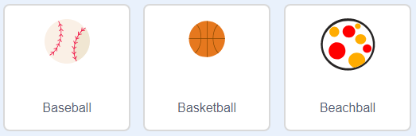
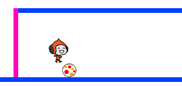

## Уклонение от мячей

Твой персонаж теперь может двигаться и прыгать, поэтому пришло время добавить несколько мячей, от которых персонаж должен уворачиваться.

\--- task \---

Создай спрайт новый мячик. Ты можешь выбрать любой тип мяча, который тебе нравится.



\--- /task \---

\--- task \---

Измени размер спрайта мяча так, чтобы персонаж мог перепрыгнуть через него. Попробуй заставить персонаж перепрыгнуть через мяч, чтобы проверить, нужного ли размера мяч.



\--- /task \---

\--- task \---

Добавь этот код к спрайту мяча:


```blocks3
когда щёлкнут по зелёному флагу
спрятаться
повторять всегда 
  ждать (3) секунд
  создать клон (себя v)
конец
```

```blocks3
когда я начинаю как клон
перейти в x: (160) y: (160)
показаться
повторить (22) раз 
  изменить y на (-4)
конец
повторить (170) раз 
  изменить x на (-2)
  повернуть влево на (6) градусов
конец
повторить (30) раз 
  изменить y на (-4)
конец
удалить клон
```

Этот код создаёт новый клон спрайта мяча каждые три секунды. Каждый новый клон движется вдоль верхней платформы, а затем падает.

\--- /task \---

\--- task \---

Нажми на зелёный флаг, чтобы проверить игру.


\--- /task \---

\--- task \---

Добавь код к спрайту мяча так, чтобы его клоны перемещались по всем трём платформам.


\--- hints \---

\--- hint \---

Скопируй блоки кода, которые ты использовал, чтобы перемещать клон спрайта шара на первой платформе. Тебе нужно изменить числа в `х`{:class="block3motion"}, `у`{:class="block3motion"} и `повторить`{:class="block3control"}, чтобы клоны правильно следовали по платформам.

\--- /hint \---

\--- hint \---

Вот блоки, которые тебе понадобятся. Убедись, что ты добавил их в правильном порядке.


```blocks3
повторить (170) раз 
  изменить x на (-2)
  повернуть влево на (6) градусов
конец

повторить (180) раз 
  изменить x на (2)
  повернуть вправо на (6) градусов
конец

повторить (30) раз 
  изменить y на (-4)
конец
```

\--- /hint \---

\--- hint \---

Код для клонов спрайтов мячей должен выглядеть так:


```blocks3
когда я начинаю как клон
перейти в x: (160) y: (160)
показаться
повторить (22) раз 
  изменить y на (-4)
конец
повторить (170) раз 
  изменить x на (-2)
  повернуть влево на (6) градусов
конец
повторить (30) раз 
  изменить y на (-4)
конец
повторить (180) раз 
  изменить x на (2)
  повернуть вправо на (6) градусов
конец
повторить (30) раз 
  изменить y на (-4)
конец
повторить (170) раз 
  изменить x на (-2)
  повернуть влево на (6) градусов
конец
удалить клон
```

\--- /hint \---

\--- /hints \---

\--- /task \---

\--- task \---

Теперь добавь несколько блоков кода для передачи (отправки) сообщения, если в твой персонаж попадёт мяч!

Добавь этот код к спрайту мяча:


```blocks3
    when I start as a clone
    forever
        if < touching (Pico walking v)? > then
            broadcast (hit v)
        end
    end
```

\--- /task \---

\--- task \---

Наконец, добавь блоки кода спрайту персонажа, чтобы он возвращался в исходное положение, когда он получает сообщение `удар`:


```blocks3
    when I receive [hit v]
    point in direction (90)
    go to x: (-210) y: (-120)
```

\--- /task \---

\--- task \---

Проверь свой код. Проверь, возвращается ли персонаж обратно к началу после касания мяча.

\--- /task \---