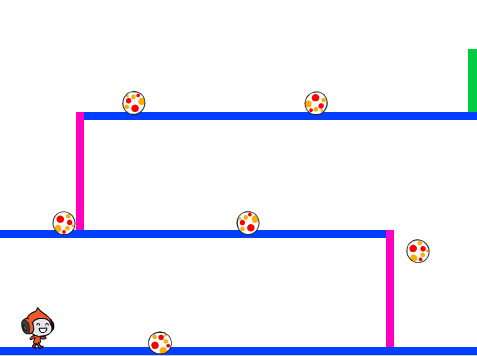

## Уклонение от мячей

Твой персонаж теперь может двигаться и прыгать, поэтому пришло время добавить несколько мячей, от которых персонаж должен уворачиваться.

--- task ---

Создай спрайт новый мячик. Ты можешь выбрать любой тип мяча, который тебе нравится.


--- /task ---

--- task ---

Измени размер спрайта мяча так, чтобы персонаж мог перепрыгнуть через него. Попробуй заставить персонаж перепрыгнуть через мяч, чтобы проверить, нужного ли размера мяч.


--- /task ---

--- task ---

Добавь этот код к спрайту мяча:


```blocks3
when green flag clicked
hide
forever 
  wait (3) seconds
  create clone of (myself v)
end
```

```blocks3
when I start as a clone
go to x: (160) y: (160)
show
repeat (22) 
  change y by (-4)
end
repeat (170) 
  change x by (-2)
  turn ccw (6) degrees
end
repeat (30) 
  change y by (-4)
end
delete this clone
```

Этот код создаёт новый клон спрайта мяча каждые три секунды. Каждый новый клон движется вдоль верхней платформы, а затем падает.

--- /task ---

--- task ---

Нажми на зелёный флаг, чтобы проверить игру.


--- /task ---

--- task ---

Добавь код к спрайту мяча так, чтобы его клоны перемещались по всем трём платформам.



--- hints ---


--- hint ---

Скопируй блоки кода, которые ты использовал, чтобы перемещать клон спрайта шара на первой платформе. Тебе нужно изменить числа в `х`{:class="block3motion"}, `у`{:class="block3motion"} и `повторить`{:class="block3control"}, чтобы клоны правильно следовали по платформам.

--- /hint ---

--- hint ---

Вот блоки, которые тебе понадобятся. Убедись, что ты добавил их в правильном порядке.


```blocks3
repeat (170) 
  change x by (-2)
  turn ccw (6) degrees
end

repeat (180) 
  change x by (2)
  turn cw (6) degrees
end

repeat (30) 
  change y by (-4)
end
```

--- /hint ---

--- hint ---

Код для клонов спрайтов мячей должен выглядеть так:


```blocks3
when I start as a clone
go to x: (160) y: (160)
show
repeat (22) 
  change y by (-4)
end
repeat (170) 
  change x by (-2)
  turn ccw (6) degrees
end
repeat (30) 
  change y by (-4)
end
repeat (180) 
  change x by (2)
  turn cw (6) degrees
end
repeat (30) 
  change y by (-4)
end
repeat (170) 
  change x by (-2)
  turn ccw (6) degrees
end
delete this clone
```

--- /hint ---

--- /hints ---

--- /task ---

--- task ---

Теперь добавь несколько блоков кода для передачи (отправки) сообщения, если в твой персонаж попадёт мяч!

Добавь этот код к спрайту мяча:


```blocks3
    when I start as a clone
    forever
        if < touching (Пико ходит v)? > then
            broadcast (удар v)
        end
    end
```

--- /task ---

--- task ---

Наконец, добавь блоки кода спрайту персонажа, чтобы он возвращался в исходное положение, когда он получает сообщение `удар`:


```blocks3
    when I receive [удар v]
    point in direction (90)
    go to x: (-210) y: (-120)
```

--- /task ---

--- task ---

Проверь свой код. Проверь, возвращается ли персонаж обратно к началу после касания мяча.

--- /task ---