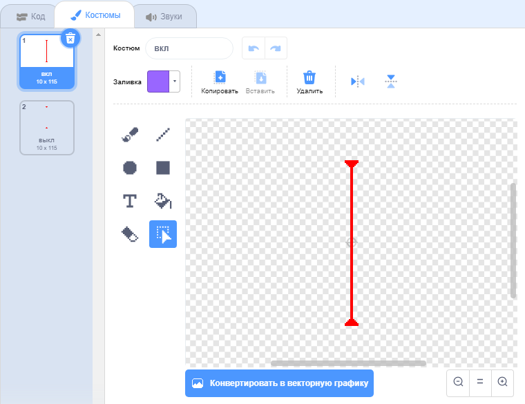
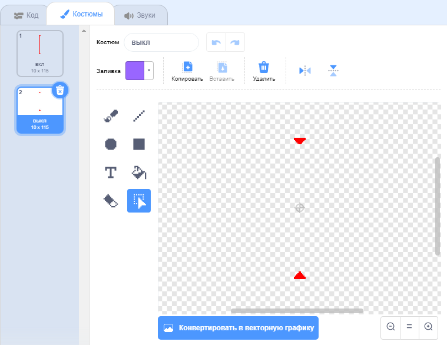

## Лазеры!

Давай сделаем игру сложнее и добавим в нее лазеры!

\--- task \---

Добавь новый спрайт в свою игру и назови его `лазер`. У него должно быть два костюма: с именами«вкл» и «выкл».





\--- /task \---

\--- task \---

Помести свой новый спрайт лазер между двумя платформами.


\--- /task \---

\--- task \---

Добавь код к спрайту лазер так, чтобы он переключался между двумя костюмами.


```blocks3
    когда щёлкнут по зелёному флагу
  повторять всегда
    изменить костюм на (вкл v)
    ждать (2) секунд
    изменить костюм на (выкл v)
    ждать (2) секунд
  конец
```

Если хочешь, можешь изменить код выше так, чтобы спрайт `ждал`{:class="block3control"} `случайный`{:class="block3operators"} промежуток времени для смены костюма.

\--- /task \---

\--- task \---

Наконец, добавь код в спрайт лазер так, чтобы спрайт передавал сообщение «удар», когда он касается спрайта персонажа.

\--- hints \---

\--- hint \---

Этот код должен быть очень похож на код, который ты добавил для спрайта мяч.

\--- /hint \---

\--- hint \---

Скопируй код, который ты добавил в спрайт мяч, чтобы этот спрайт `передавал сообщение 'удар'`{:class="block3control"} когда `касается твоего персонажа`{:class="block3sensing"}.

\--- /hint \---

\--- hint \---

Нужно добавить такой код:


```blocks3
when green flag clicked
forever 
  if <touching (Pico walking v) ?> then 
    broadcast (hit v)
  end
end
```

\--- /hint \---

\--- /hints \---

Не нужно добавлять дополнительный код к твоему спрайту персонажа, потому что спрайт персонажа уже знает, что делать, когда получает `сообщение 'удар'`{:class="block3control"}!

\--- /task \---

\--- task \---

Проверь свою игру, чтобы увидеть, можешь ли ты отодвинуть персонаж от лазера. Если от лазера слишком просто или слишком трудно уклониться, измени код блока `ждать`{:class="block3control"} спрайта лазер.

\--- /task \---