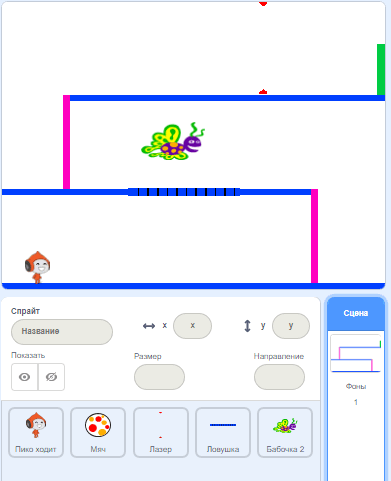

## Задание: больше препятствий

Если на твой взгляд игра всё ещё слишком проста, ты можешь добавить больше препятствий. Препятствиями может быть всё что угодно! Вот несколько идей:

+ Опасная бабочка
+ Платформы, которые появляются и исчезают
+ Падающие теннисные мячи, от которых нужно уворачиваться



Ты даже можешь создать другой фон для следующего уровня. Затем добавь код, чтобы, когда персонаж достигал зелёной двери, игра переключалась на новый фон:


```blocks3
    if <touching color [#00FF00]?> then
		  switch backdrop to (next backdrop v)
		  go to x: (-210) y: (-120)
		  wait (1) seconds
	  end
```