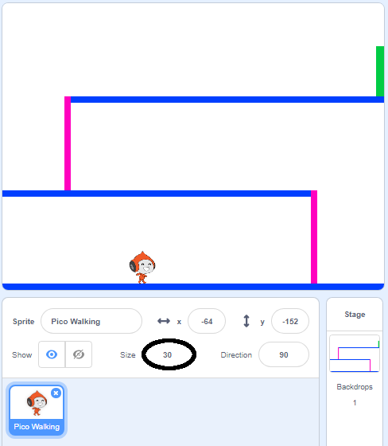

## චරිත(character) චලනය(movement)

වමට සහ දකුණට ගමන් කළ හැකි සහ ඉණිමගක නැඟිය හැකි චරිතයක්(character එකක්) නිර්මාණය කිරීමෙන් අරඹන්න.

\--- task \---

'ඩොජ්බෝල්' Scratch ආරම්භක(starter) ව්‍යාපෘතිය(project එක) විවෘත කරන්න.

**අන්තර්ජාල මාර්ගගත(Online):** [rpf.io/dodgeball-on](http://rpf.io/dodgeball-on){:target="_blank"} හි ආරම්භක(starter) ව්‍යාපෘතියක්(project එකක්) විවෘත කරන්න.

ඔබට Scratch ගිණුමක්(account එකක්) තිබේ නම් **රීමික්ස්(Remix)** ක්ලික් කිරීමෙන් පිටපතක් සාදාගත හැකිය.

**නොබැඳි(offline):** [rpf.io/p/en/dodgeball-get](http://rpf.io/p/en/dodgeball-get) {:target="_blank"} වෙතින් ආරම්භක(starter) ව්‍යාපෘතිය(project) බාගන්න(download කර) ඉන්පසු නොබැඳි(offline) සංස්කාරකය(editor එක) භාවිතයෙන් එය විවෘත කරන්න.

\--- /task \---

ව්යාපෘතියේ(project) පසුබිමක්(backdrop එකක්) සහිත වේදිකාවක් අඩංගු වේ:


\--- task \---

ක්‍රීඩකයා විසින් පාලනය(control) කරනු ලබන චරිතය(character එක) ලෙස නව sprite එකක් තෝරාගෙන, එය ඔබේ ව්‍යාපෘතියට(project එකට) එක් කරන්න. ඔබ නානාවිධ(multiple) ඇදුම්(costumes) සහිත sprite එකක් තෝරා ගන්නේ නම් වඩාත් සුදුසුය, එවිට ඔබට එය ඇවිදින බවක් පෙනෙන්නට සැලැස්විය හැක.


[[[generic-scratch3-sprite-from-library]]]

\--- /task \---

\--- task \---

ක්‍රීඩකයාට ඊතල(arrow) යතුරු(keys) භාවිතා කර චරිතය(character එක) එහා මෙහා ගෙන යා හැකි පරිදි ඔබේ sprite චරිතයට කේත(code) කට්ටි(blocks) එකතු කරන්න. ක්‍රීඩකයා දකුණු(right) ඊතල(arrow) යතුර(key එක) එබූ විට, චරිතය(character එක) දකුණට යොමුවී, පියවර කිහිපයක් ගොස් ඊළඟ ඇඳුමට(costume එකට) මාරු විය යුතුය:


```blocks3
when flag clicked forever
    if <key (right arrow v) pressed? > then
        point in direction (90 v)
        move (3) steps
        next costume
    end
end
```

\--- /task \---

\--- task \---

ඔබේ sprite එකේ ප්‍රමාණය(size එක) නොගැලපේ නම්, එහි ප්‍රමාණය(size එක) වෙනස් කරන්න.



\--- /task \---

\--- task \---

කොඩිය මත ක්ලික් කර දකුණු(right) ඊතල(arrow) යතුර(key) ඔබාගෙන සිටීමෙන් ඔබේ චරිතය(character එක) පරීක්ෂා(test) කරන්න. ඔබේ චරිතය(character එක) දකුණට ගමන් කරයිද? ඔබේ චරිතය(character එක) ඇවිදින ආකාරයක් පෙන්නුම්කරයිද?


\--- /task \---

\--- task \---

වම් ඊතල යතුර එබුවහොත් චරිතය(character එක) වමට ගමන් කරන පරිදි, sprite චරිතයෙහි(character's) `සදහටම(forever)`{:class="block3control"} ලුපයට කේත(code) කට්ටි(blocks) එක් කරන්න.

\--- hints \---

\--- hints \---

ඔබේ චරිතයට(character එකට) වමට ගමන් කළ හැකි වන පරිදි, ඔබ `සදහටම(forever)`{:class="block3control"} ලූපය ඇතුළත තවත් `නම්(if)`{:class="block3control"} කට්ටියක්(block එකක්) එකතු කළ යුතුයි. මෙම නව `නම්(if)`{:class="block3control"} කට්ටිය(block එක) තුළ, ඔබේ sprite චරිතය `චලනය(move)`{:class="block3motion"} කරවීමට කේතයක්(code එකක්) එක් කරන්න.

\--- /hint \---

\--- hints \---

චරිතය(character එක) දකුණට ගමන් කරවීම සඳහා ඔබ නිර්මාණය කළ කේතය(code එක) අනුපිටපත්(copy) කරන්න. ඉන්පසු `යතුර එබූ(key pressed)`{:class="block3sensing"} යන්න `වම් ඊතලය(left arrow)`{:class="block3sensing"} ලෙස සකසන්න, දැන් `දිශාව(direction එක)`{:class="block3motion"} `-90` ට වෙනස් කරන්න.

```blocks3
if <key (right arrow v) pressed? > then
    point in direction (90 v)
    move (3) steps
    next costume
end
```

\--- /hint \---

\--- hints \---

ඔබේ කේතය(code එක) මේ ආකාරයේ එකක් විය යුතුය:


```blocks3
when green flag clicked
forever
  if <key (right arrow v) pressed?> then
    point in direction (90 v)
    move (3) steps
    next costume
  end
  if <key (left arrow v) pressed?> then     point in direction (-90 v)
    move (3) steps
    next costume
  end
end
```

\--- /hint \---

\--- /hint \---

\--- /task \---

\--- task \---

ඔබගේ නව(new) කේතය(code එක) නිවැරදිව ක්‍රියාත්මක වන්නේදැයි පරික්ෂා(test) කරන්න. වමට ඇවිදින විට ඔබේ චරිතය(character එක) උඩු යටිකුරු වේද?


එසේ නම්, ඔබේ sprite චරිතයේ(character එකේ) **දිශාව(direction එක)** ක්ලික් කිරීමෙන් පසුව වම්-දකුණු ඊතලය මත ක්ලික් කිරීමෙන්, ඔබට මෙය නිවැරදි කළ හැකියි.


නැතහොත් ඔබ කැමති නම්, ඔබේ චරිතයේ(character) ස්ක්‍රිප්ට්(script) එකේ ආරම්භයට මෙම කට්ටිය(block එක) එකතු කිරීමෙන් ද මෙම ගැටළුව විසඳා ගත හැකියි:

```blocks3
set rotation style [left-right v]
```

\--- /task \---

\--- task \---

රෝස ඉණිමඟක(ladder එකක) නැගීමට, ඔබේ sprite චරිතය(character එක) නිවැරදි වර්ණය ස්පර්ශ කරන විට **සහ(and)** උඩු ඊතලය එබූ සෑම අවස්ථාවකම වේදිකාවේ පියවර කිහිපයක් ඉහළට ගමන් කළ යුතුයි.

ඔබගේ චරිතයේ `සදහටම(forever)`{:class="block3control"} ලූපය තුළට `ඉහළ ඊතලය එබීම (up arrow is pressed)`{:class="block3sensing"} සහ චරිතය `රෝස පැහැය ස්පර්ශ කිරීම(touching the colour pink)`{:class="block3sensing"} සිදු කරයි `නම්(if)`{:class="block3control"} චරිතයේ `y` සිරස්(vertical) පිහිටීම(position එක) `වෙනස් කරන්න(change)`{:class="block3motion"} යන්න එක් කරන්න. 


```blocks3
    if < <key (up arrow v) pressed?> and <touching color [#FF69B4]?> > then
        change y by (4)
    end
```

\--- /task \---

\--- task \---

ඔබේ කේතය(code එක) පරීක්ෂා(test) කරන්න. ඔබට චරිතය(character එක) රෝස ඉණිමඟ නග්ගවා මට්ටමමේ(level එකේ) අවසානය කරා පැමිණිය හැකිද?


\--- /task \---