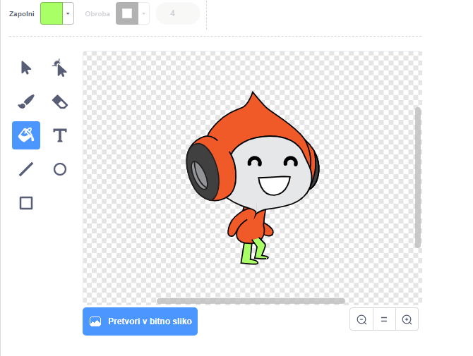

## Izziv: izboljšana gravitacija

V tvoji igri je še en mali hrošč: gravitacija ne potegne lika navzdol, če se **katerikoli** del figure dotika modre ploščadi. Četudi se figura z glavo dotakne ploščadi, ne pade dol! To lahko preizkusiš tudi sam: z likom zlezi skoraj do vraha lestve in se potem premakni v smeri ploščadi:


Za popravilo tega hrošča naredi svoji figuri nove hlače, ki so drugačne barve (na **vseh** videzih).



Nato nadomesti ta blok kode:

```blocks3
    < se dotika barve [#0000FF]? >
```

s to kodo:

```blocks3
    < se barva [#00FF00] dotika [#0000FF]? >
```

Prepričaj se, da si odpravil hrošč, tako da preizkusiš igro po tem, ko si opravil te spremembe!