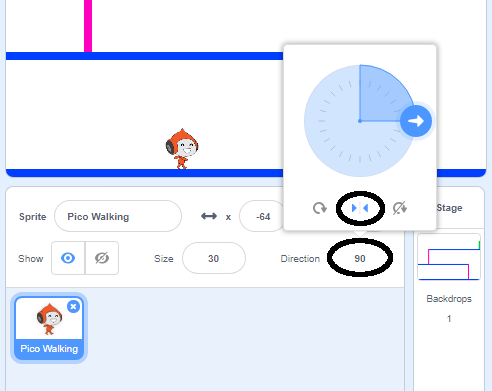

## Gibanje likov

Začni s tem, da ustvariš lik, ki se lahko premika levo in desno in ki lahko pleza po lestvah.

\--- task \---

Odpri začetni projekt 'Pazi, žoga!'.

**Spletno:** Odpri začetni projekt na [rpf.io/dodgeball-on](http://rpf.io/dodgeball-on){: target = "_ blank"}.

Če imaš Scratch uporabniški račun, lahko ustvariš kopijo s klikom na **Predelaj**.

** Brez povezave: ** prenesi začetni projekt iz [rpf.io/p/en/dodgeball-get](http://rpf.io/p/en/dodgeball-get) {: target = "_ blank"} in ga nato odpri s pomočjo namiznega urejevalnika.

\--- /task \---

Projekt vsebuje ozadje s ploščadmi:


\--- task \---

Izberi novo figuro za lik, ki ga bo igralec upravljal in ga dodaj v tvoj projekt. Najbolje je, da izbereš figuro, ki ima več videzov, da bo videti, kot da tvoja figura hodi.


[[[generic-scratch3-sprite-from-library]]]

\--- /task \---

\--- task \---

Figuri lika dodaj kodo, da bo lahko igralec uporabljal smerne tipke za premikanje lika. Ko igralec pritisne desno tipko, bi lik moral gledati v desno, se premakniti nekaj korakov in zamenjati videz v naslednjega:


```blocks3
ko kliknemo na zastavico
ponavljaj
  če <je pritisnjena tipka (puščica desno v)? > potem
        obrni se v smer (90 v)
        pojdi (3) korakov
        naslednji videz
    konec
konec
```

\--- /task \---

\--- task \---

Če tvoja figura ni primerne velikosti, jo spremeni.


\--- /task \---

\--- task \---

Preizkusi svoj lik s klikom na zastavo in pritisnjeno desno smerno tipko. Ali se lik premika v desno? Ali je videti, kot da bi hodil?


\--- /task \---

\--- task \---

Liku figure dodaj kodo v zanko `ponavljaj`{:class="block3control"}, da bo hodil v levo, kadar je pritisnjena leva smerna tipka.

\--- hints \---

\--- hint \---

Da bi se tvoj lik lahko premikal v levo, je potrebno dodati še en blok `če`{:class="block3control"} v zanko `ponavljaj`{:class="block3control"}. V ta novi blok `če`{:class="block3control"} dodaj kodo, ki bo poskrbela, da se bo lik tvoje figure `premikal`{:class="block3motion"} v levo.

\--- /hint \---

\--- hint \---

Skopiraj kodo, ki si jo ustvaril za gibanje lika v desno. Potem nastavi `pritisnjeno tipko`{:class="block3sensing"} na `puščico levo`{:class="block3sensing"}, in obrni `smer`{:class="block3motion"} na `-90`.

```blocks3
če <je pritisnjena tipka (puščica levo v)? > potem
        obrni se v smer (-90 v)
        pojdi (3) korakov
        naslednji videz
    konec
konec
```

\--- /hint \---

\--- hint \---

Tvoja koda bo izgledala nekako tako:


```blocks3
ko kliknemo na zastavico
ponavljaj
  če < je pritisnjena tipka (puščica desno v)? > potem
        obrni se v smer (90 v)
        pojdi (3) korakov
        naslednji videz
    konec
    če < je pritisnjena tipka (puščica levo v)? > potem
        obrni se v smer (-90 v)
        pojdi (3) korakov
        naslednji videz
    konec
konec
```

\--- /hint \---

\--- /hints \---

\--- /task \---

\--- task \---

Preizkusi svojo novo kodo in se prepričaj, da deluje. Ali se tvoj lik postavi na glavo, kadar hodi v levo?


Če je temu tako, to popravi tako, da klikneš na **smer** figure lika in potem klikneš na dvojno puščico levo-desno.



Lahko pa težavo popraviš tudi tako, da dodaš ta blok kode na začetek svojega programa:

```blocks3
Način vrtenja [levo-desno v]
```

\--- /task \---

\--- task \---

Da bi plezal po roza lestvah mora tvoja figura lika iti nekaj korakov navzgor, vsakič ko je pritisnjena smerna tipka za gor **in** se lik dotika prave barve.

Znotraj zanke `ponavljaj`{:class="block3control"} v liku dodaj `spremeni`{:class="block3motion"} figurin `y` (navpični) položaj `če`{:class="block3control"} `je pritisnjena puščica gor`{:class="block3sensing"} in se lik `dotika roza barve`{:class="block3sensing"}.


```blocks3
    če <<je pritisnjena tipka (puščica gor)?> in <se dotika barve (FF69B4)?>>
  spremeni y za (4)
konec
```

\--- /task \---

\--- task \---

Preveri svojo kodo. Ali lahko povedeš svoj lik po roza lestvah in prideš do konca stopnje?


\--- /task \---