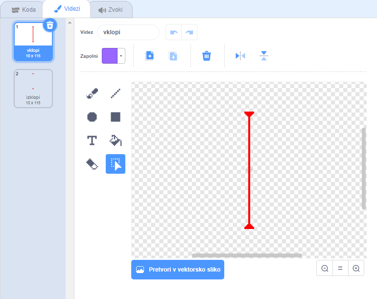
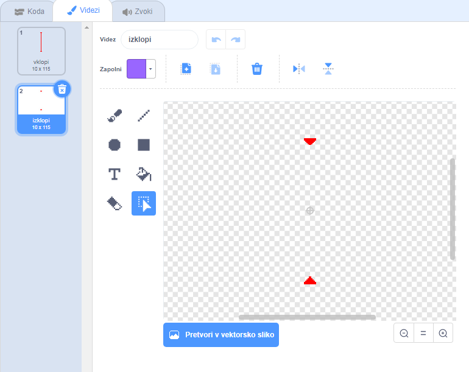

## Laserji!

Da bo tvoja igra težja, dodaj še laserje!

\--- task \---

Igri dodaj novo figuro in jo poimenuj `laser`. Imeti mora dva videza: enega, ki se imenuje 'vklopi' in drugega z imenom 'izklopi'.





\--- /task \---

\--- task \---

Namesti svoj laser med dve ploščadi.


\--- /task \---

\--- task \---

Figuri laserja dodaj kodo, ki bo preklapljala med obema videzoma.


```blocks3
    ko je kliknjena zelena zastavica
ponavljaj 
  zamenjaj videz na (vklopi v)
  počakaj (2) sekund
  zamenjaj videz na (izklopi v)
  počakaj (2) sekund
end
```

Če hočeš, lahko spremeniš zgornjo kodo, tako da figura `počaka`{:class="block3control"} `nakljkučno`{:class="block3operators"} časa med spremembo videza.

\--- /task \---

\--- task \---

Zdaj dodaj figuri laserja še kodo, da bo objavila sporočilo 'zadet', ko se dotakne lika figure.

\--- hints \---

\--- hint \---

Ta koda je zelo podobna kodi, ki si jo dodal-a figuri žoge.

\--- /hint \---

\--- hint \---

Skopiraj kodo, ki si jo doda-al figuri žoge, da `objavi 'zadet'`{:class="block3control"}, kadar `se dotika tvojega lika`{:class="block3sensing"}.

\--- /hint \---

\--- hint \---

To je koda, ki jo moraš dodati:


```blocks3
ko je kliknjena zelena zastavica
ponavljaj 
  če <se dotika (Pico walking v) ?> potem 
    objavi (zadet v)
  end
end
```

\--- /hint \---

\--- /hints \---

Tvoja figura lika ne potrebuje dodatne kode, ker že ve, kaj mora storiti, ko prejme `objavo 'zadet'`{:class="block3control"}!

\--- /task \---

\--- task \---

Preizkusi igro, da vidiš ali lahko greš z likom mimo laserja. Če je izogibanje laserju preenostavno ali pretežko, spremeni čas za kodo `počakaj`{:class="block3control"} v figuri laserja.

\--- /task \---