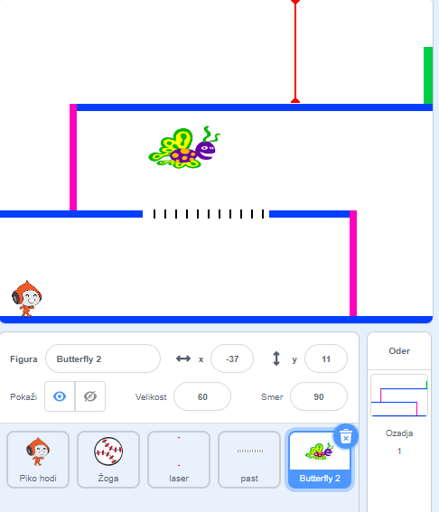

## Izziv: Več ovir

Če meniš, da je tvoja igra še vedno preveč enostavna, ji lahko dodaš še več ovir. Ovire so lahko karkoli želiš! Tu je nekaj idej:

+ Nevaren metulj
+ Ploščadi, ki se pojavijo in izginejo
+ Padajoče teniške žogice, ki se jih je potrebno izogibati



Lahko ustvariš tudi drugo ozadje in ustvariš naslednjo stopnjo. V tem primeru dodaj kodo, ki bo povzročila, da se, ko igralec doseže zelena vrata, zamenja ozadje:


```blocks3
    če <se dotika barve [#00FF00]?> potem 
  zamenjaj ozadje na (naslednje ozadje v)
  pojdi na x: (-210) y: (-120)
  počakaj (1) sekund
end
```