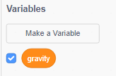

## Гравітація і стрибки

Давайте дамо вашому персонажу рухатись реалістичніше, додавши гравітацію і дозволивши стрибки.

+ Ви напевно помітили що ваш персонаж може зійти з платформи і іти по повітрю. Спробуйте зійти з платформи і погляньте що буде.
    
    

+ Щоб цього не було, додаймо гравітацію у вашу гру. Давайте створимо змінну що називається `gravity`{:class="blockdata"}. Ви можете забрати цю змінну з вашого рівня якщо хочете.
    
    

+ Додайте блок коду, який робить гравітацію негативним числом, і потім використовує це щоб повторно змінювати Y-координати вашого персонажа.
    
    ```blocks
        коли натиснуто ⚑ 
        set [gravity v] to [-4]
        forever
            change y by (gravity)
        end
    ```

+ Натисніть прапорець і перетягніть свого персонажа на верх рівня. Що трапилось? Чи працює гравітація як ви очікували?
    
    

+ Гравітація не повинна пересувати персонажа через платформу чи драбину! Додайте блок `if`{:class="blockcontrol"} до вашого коду, щоб гравітація працювала тільки коли ваш персонаж у повітрі. Ваш код повинен виглядати так:
    
    ```blocks
        коли натиснуто ⚑
        set [gravity v] to [-4]
        forever
            if < not < <touching color [#0000FF]?> or <touching color [#FF69B4]?> > > then
                change y by (gravity)
            end
        end
    ```

+ Протестуйте гравітацію ще раз. Чи зупиняється ваш персонаж коли він на платформі або сходах? Чи можете ви зійти з краю платформи на нижчі рівні?
    
    

+ Давайте також заставимо персонажа стрибати коли гравець натискає пробіл. Один простий спосіб це зробити це підняти вашого персонажа вверх, використовуючи цей код:
    
    ```blocks
        when [space v] key pressed
        repeat (10)
            change y by (4)
        end
    ```
    
    Так як гравітація опускає вашого персонажа на 4 пікселі вниз, вам потрібно вибрати число, більше 4 у вашому блоці `change y by (4)`{:class="blockmotion"}. Змінюйте це число допоки не будете задоволені висотою стрибка вашого персонажа.

+ Якщо ви протестуєте цей код, ви помітите, що він працює, але рухи не достатньо плавні. Щоб стрибки виглядали плавніше, вам потрібно пересунути ваше число на все менші і менші кількості, допоки він вже більше не стрибає.

+ Щоб зробити це, створіть ще одну змінну яка називається `jump height`{:class="blockdata"}. І ви також можете заховати цю змінну.

+ Видаліть код стриба який ви додали до вашого персонажа і замініть його цим кодом:
    
    ```blocks
        when [space v] key pressed
        set [jump height v] to [8]
        repeat until < (jump height) = [0] >
            change y by (jump height)
            change [jump height v] by (-0.5)
        end
    ```
    
    Цей код пересуває персонажа вверх на 8 пікселів, потім на 7.5 пікселів, потім на 7 пікселів і так далі, допоки ваш персонаж не перестане стрибати. Це робить стрибки набагато плавнішими.

+ Змініть початкове число змінної `jump height`{:class="blockdata"} і тестуйте її допоки не будете задоволені висотою на яку стрибає ваш персонаж.