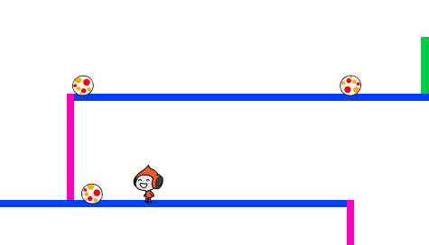

## Відбивати м'ячі

Тепер коли ви змогли заставити вашого персонажа рухатись, давайте додамо м'ячі щоб він їх уникав.

+ Створіть новий спрайт м'яча. Ви можете обрати будь-який вид м'яча.
    
    

+ Змініть розміри м'яча щоб ваш персонаж зміг його перестрибнути. Перестрибніть через м'яч щоб протестувати це.
    
    

+ Додайте цей код до вашого м'яча:
    
    
    
    Цей код створює клонів м'яча кожні 3 секунди. Кожен новий клон рухається зверху платформи.

+ Натисніть на прапорець щоб протестувати це.
    
    

+ Додайте ще більше коду до спрайту вашого м'яча, щоб той міг рухатись через усі 3 платформи.
    
    

+ Нарешті, вам потрібен код коли ваш персонаж вдаряється об м'яч! Додайте цей код до спрайту вашого м'яча:
    
    ```blocks
        when I start as a clone
        forever
            if < touching [Pico walking v]? > then
                broadcast [hit v]
            end
        end
    ```

+ Також потрібно буде додати код до вашого персонажа щоб той повертався на початок коли у нього попадають:
    
    ```blocks
        when I receive [hit v]
        point in direction (90 v)
        go to x: (-210) y: (-120)
    ```

+ Протестуйте вашого персонажа і подивіться чи він повертається на початок коли у нього попадає м'яч.