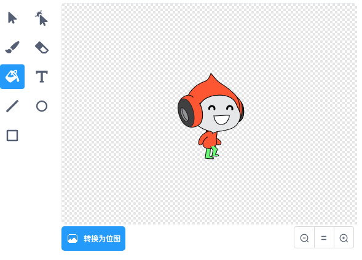

## 挑战：改进的重力

您的游戏中还有另外一个小 bug: 如果游戏精灵的 **任何** 部位接触到了蓝色的平台，那么角色精灵将不会下落 因此，即使是精灵头部接触平台，精灵也不会掉落！ 您可以测试一下：让角色精灵爬上梯子，但不是完全爬上梯子，然后将角色精灵移动到平台下方:


要修复该错误，首先需要给角色精灵换一条具有不同颜色的新裤子(需要在角色精灵的 **所有** 造型中都应用这一改变)。



然后替换此代码块：

```blocks3
    < 碰到颜色 [#0000FF]? >
```

使用以下代码块：

```blocks3
    < 颜色 [#00FF00] 碰到 [#0000FF]? >
```

为确保错误已被修复，请在进行这些更改后测试游戏！