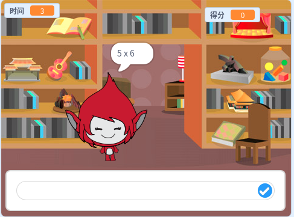

## 接下来还有什么？

尝试我们的[头脑游戏](https://projects.raspberrypi.org/en/projects/brain-game?utm_source=pathway&utm_medium=whatnext&utm_campaign=projects)项目，您可以在其中创建自己的数学测验。

\--- no-print \---

Click the button to start. Type in the answer to the question, and then press the <kbd>Enter</kbd> key.

  <iframe allowtransparency="true" width="485" height="402" src="https://scratch.mit.edu/projects/embed/250234955/?autostart=false" frameborder="0" scrolling="no"></iframe>
  

\--- /no-print \---

\--- print-only \---

\--- /print-only \---