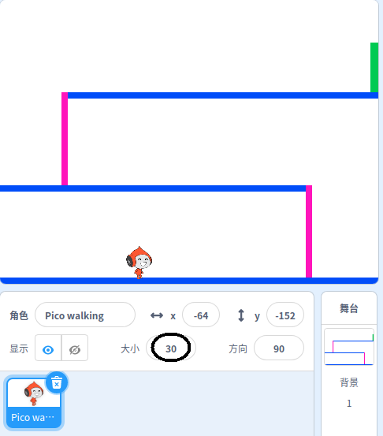

## 角色移动

首先创建一个可以左右移动并可以爬上梯子的角色。

\--- task \---

打开 'Dodgeball' Scratch 启动项目。

**在线编辑:** 在 [rpf.io/dodgeball-on](http://rpf.io/dodgeball-on){:target =“_ blank”} 打开初始项目。

如果您有一个 Scratch 帐户，您可以通过点击 **改编** 复制该项目。

**离线编辑:** 从 [rpf.io/p/en/dodgeball-get](http://rpf.io/p/en/dodgeball-get) 下载初始项目，然后使用 Scratch 离线编辑器打开它。

\--- /task \---

该项目包含一个带有平台图案的背景：


\--- task \---

选择一个新的精灵作为玩家将控制的角色，并将其添加到您的项目中。 最好选择带有走路动画的精灵，这样可以让它看起来更加自然


[[[generic-scratch3-sprite-from-library]]]

\--- /task \---

\--- task \---

向您的角色精灵添加代码块，以便玩家可以使用方向键来移动角色。 当玩家按下向右箭头时，角色应向右侧移动几步，然后换成下一个造型：


```blocks3
当 绿旗 被点击
重复执行
    如果 <按下 (右箭头) 键? > 那么
        面向 (90) 方向
        移动 (3) 步
        下一个造型
    结束
结束
```

\--- /task \---

\--- task \---

如果您的精灵不适合，请调整其大小。



\--- /task \---

\--- task \---

通过单击绿旗并按住向右箭头键来测试您的角色。 您的角色是否向右移动？ 您的角色看起来像在走路吗？


\--- /task \---

\--- task \---

将代码块添加到精灵的 `重复执行`{:class="block3control"}循环，这样当左箭头按下时，它就可以向左走了。

\--- hints \---

\--- hint \---

为了你的角色能够向左走，你需要在`重复执行`{:class="block3control"} 积木中添加另一个`如果`{:class="block3control"} 积木。 在这个新的 `如果`{:class="block3control"} 积木中，添加代码使你的角色精灵向左 `移动`{:class="block3motion"}。

\--- /hint \---

\--- hint \---

复制你刚创建的使角色向右走的代码。 然后设置 `按下` {：class =“ block3sensing”} `左箭头` {：class =“ block3sensing”} 键，然后更改`面向` {：class =“ block3motion”} 为 `-90` 方向。

```blocks3
如果 <按下 (右箭头) 键? > 那么
        面向 (90) 方向
        移动 (3) 步
        下一个造型
结束
```

\--- /hint \---

\--- hint \---

你的代码应该像这样：


```blocks3
when green flag clicked
forever 
  if <key (right arrow v) pressed?> then 
    point in direction (90 v)
    move (3) steps
    next costume
  end
  if <key (left arrow v) pressed?> then 
    point in direction (-90 v)
    move (3) steps
    next costume
  end
end
```

\--- /hint \---

\--- /hints \---

\--- /task \---

\--- task \---

Test your new code to make sure that it works. Does your character turn upside-down when walking to the left?


If so, you can fix this by clicking on the **direction** of your character sprite, and then clicking on the left-right arrow.


Or if you prefer, you can also fix the problem by adding this block to the start of your character's script:

```blocks3
set rotation style [left-right v]
```

\--- /task \---

\--- task \---

To climb a pink ladder, your character sprite should move a few steps upwards on the Stage whenever the up arrow is pressed **and** the character is touching the correct colour.

Add inside your character's `forever`{:class="block3control"} loop to `change`{:class="block3motion"} the character's `y` (vertical) position `if`{:class="block3control"} the `up arrow is pressed`{:class="block3sensing"} and the character is `touching the colour pink`{:class="block3sensing"}.


```blocks3
    if < <key (up arrow v) pressed?> and <touching color [#FF69B4]?> > then
        change y by (4)
    end
```

\--- /task \---

\--- task \---

Test your code. Can you make the character climb the pink ladders and get to the end of the level?


\--- /task \---