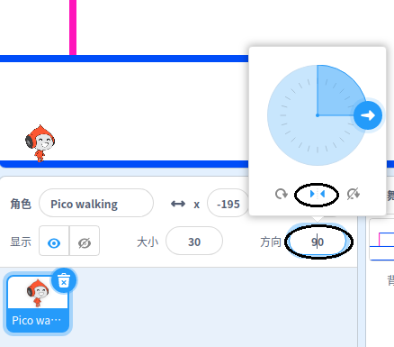

## 角色移动

首先创建一个可以左右移动并可以爬上梯子的角色。

\--- task \---

打开 'Dodgeball' Scratch 启动项目。

**在线：** 在 [rpf.io/dodgeball-on](http://rpf.io/dodgeball-on){:target =“_ blank”}打开初始项目。

如果您有一个Scratch帐户，您可以通过点击**Remix**复制。

**离线：** 从 [rpf.io/p/en/dodgeball-get](http://rpf.io/p/en/dodgeball-get) 下载初始项目，然后使用Scratch离线编辑器打开它。

\--- /task \---

该项目包含一个背景平台：


\--- task \---

选择一个新的精灵作为玩家将控制的角色，并将其添加到您的项目中。 最好选择带有多个服装的精灵，这样可以使其看起来好像正在行走。


[[[generic-scratch3-sprite-from-library]]]

\--- /task \---

\--- task \---

向您的角色精灵添加代码块，以便玩家可以使用箭头键来移动角色。 当玩家按下向右箭头时，角色应指向右侧，移动几步，然后换成下一个造型：


```blocks3
when flag clicked
forever
    if <key (right arrow v) pressed? > then
        point in direction (90 v)
        move (3) steps
        next costume
    end
end
```

\--- /task \---

\--- task \---

如果您的精灵不适合，请调整其大小。


\--- /task \---

\--- task \---

通过单击标志并按住向右箭头键来测试您的角色。 您的角色是否向右移动？ 您的角色看起来像走路吗？


\--- /task \---

\--- task \---

将代码块添加到字符精灵的`永久`{:class="block3control"}循环，这样当左箭头按下时，它就可以行走了。

\--- hints \---

\--- hint \---

为了你的角色能够移动到左边，你需要在``{:class="block3control"} 循环中添加另一个`<0>{:class="block3control"} 块。 在这个新的<code>if`{:class="block3control"}模块中，添加代码使你的角色精灵`move`{:class="block3motion"} 左边。

\--- /hint \---

\--- hint \---

复制您创建的代码，使角色向右走。 然后按`键` {：class =“ block3sensing”}到`左箭头` {：class =“ block3sensing”}，然后更改`方向` {：class =“ block3motion”}到` -90 ` 。

```blocks3
if <key (right arrow v) pressed? > then
    point in direction (90 v)
    move (3) steps
    next costume
end
```

\--- /hint \---

\--- hint \---

你的代码应该像这样：


```blocks3
when green flag clicked
forever 
  if <key (right arrow v) pressed?> then 
    point in direction (90 v)
    move (3) steps
    next costume
  end
  if <key (left arrow v) pressed?> then 
    point in direction (-90 v)
    move (3) steps
    next costume
  end
end
```

\--- /hint \---

\--- /hints \---

\--- /task \---

\--- task \---

测试您的新代码，以确保它可以工作。 向左走时，角色会颠倒过来吗？


如果是这样，您可以通过单击**方向来解决此问题**角色精灵，然后单击左右箭头。



或者如果您喜欢，您也可以通过将此块添加到您角色脚本的开头来解决问题：

```blocks3
set rotation style [left-right v]
```

\--- /task \---

\--- task \---

要爬粉红色的梯子，每当按下向上箭头**时，角色精灵应在舞台上向上移动几步，然后**字符触摸正确的颜色。

在你的角色中添加`永久`{:class="block3control"} 循环到`change`{:class="block3motion"}字符`y` (垂直)位置`if`{:class="block3controll"}, 并且角色是 `触摸彩色粉红色`{:class="block3sing"}。


```blocks3
    if < <key (up arrow v) pressed?> and <touching color [#FF69B4]?> > then
        change y by (4)
    end
```

\--- /task \---

\--- task \---

测试您的代码。 您可以让角色爬上粉红色的梯子并到达关卡的尽头吗？


\--- /task \---