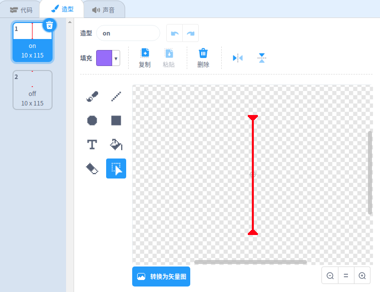
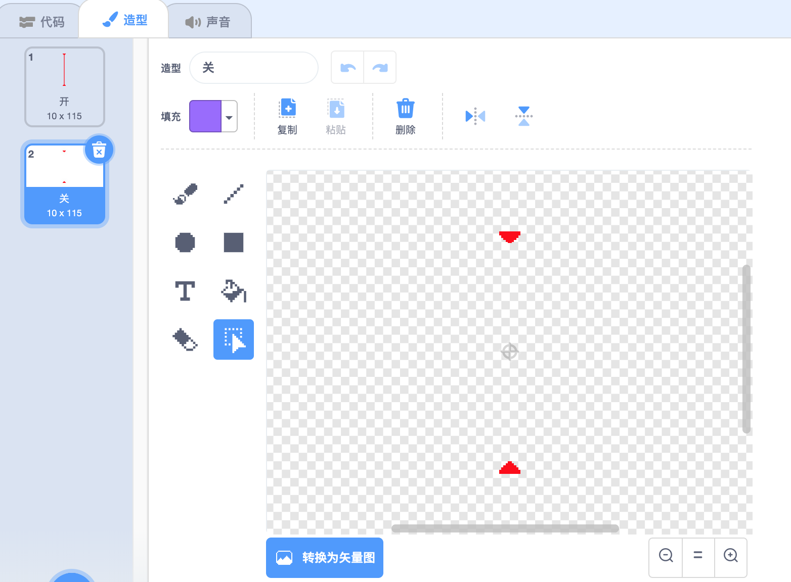

## 激光！

为了让您的游戏更难完成，您将添加激光！

\--- task \---

在游戏中添加新的精灵，并将其命名为 `laser` 。 它应该有两种造型：一种叫做 “开”，另一种叫做 “关”。





\--- /task \---

\--- task \---

将新的激光精灵放置在两个平台之间。


\--- /task \---

\--- task \---

向您的激光精灵添加代码，以使其在其两个造型之间切换。


```blocks3
    当 标志 被点击
    重复执行
        换成 (开 v) 造型
        等待 (2) 秒
        换成 (关 v) 造型
        等待 (2) 秒
    结束
```

您也可以更改上面显示的代码，以便精灵在两次造型更换之间`等待`{:class="block3control"} 一个 `随机` {:class="block3operators"} 的时间间隔 。

\--- /task \---

\--- task \---

最后，向您的激光精灵添加代码，以便激光精灵碰到角色精灵时广播 'hit' 消息。

\--- hints \---

\--- hint \---

该代码应与您添加到小球精灵中的代码非常相似。

\--- /hint \---

\--- hint \---

复制您添加到小球精灵的代码，以使该精灵 `碰到角色精灵时`{:class="block3sensing"} `广播 'hit'` 消息{:class="block3control"} 。

\--- /hint \---

\--- hint \---

这是您应该添加的代码：


```blocks3
当 标志 被点击
重复执行
  如果 <touching (Pico walking v) ?> 那么
    广播 (hit v)
  结束
结束
```

\--- /hint \---

\--- /hints \---

您无需在角色精灵上添加任何额外的代码，因为角色精灵在接收到 `广播 'hit'`{:class="block3control"} 的逻辑我们之前已经实现了！

\--- /task \---

\--- task \---

测试您的游戏，看看是否可以将角色移过激光。 如果激光躲避起来太容易或太困难，修改激光精灵代码中的 `等待`{:class="block3control"} 时间。

\--- /task \---