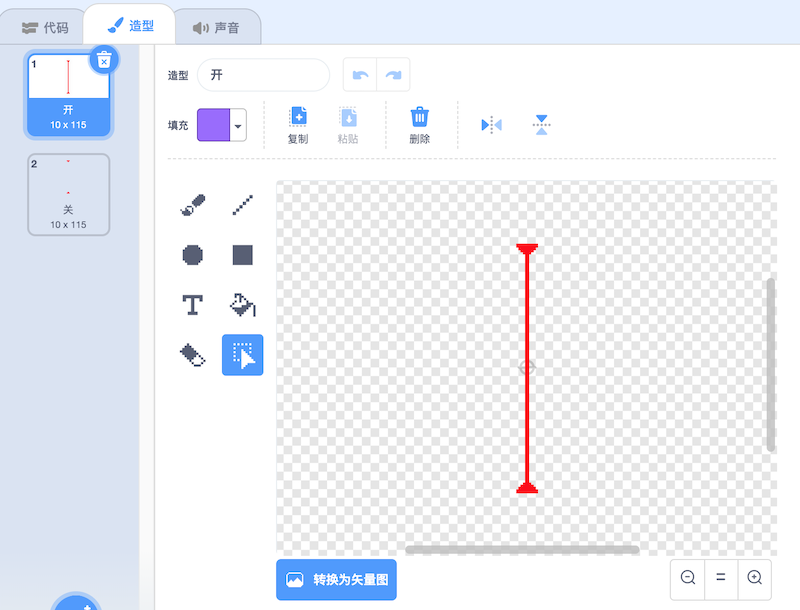

## 激光！

为了让您的游戏更难完成，您将添加激光！

\--- task \---

在游戏中添加新的精灵，并将其命名为 `laser` 。 它应该有两种造型：一种叫做 “开”，另一种叫做 “关”。




\--- /task \---

\--- task \---

将新的激光精灵放置在两个平台之间。


\--- /task \---

\--- task \---

向您的激光精灵添加代码，以使其在其两个造型之间切换。


```blocks3
    when flag clicked
    forever
        switch costume to (on v)
        wait (2) seconds
        switch costume to (off v)
        wait (2) seconds
    end
```

If you prefer, you can change the code shown above so that the sprite `waits`{:class="block3control"} a `random`{:class="block3operators"} amount of time between costume changes.

\--- /task \---

\--- task \---

Finally, add code to your laser sprite so that the laser sprite broadcasts a 'hit' message when it touches the character sprite.

\--- hints \---

\--- hint \---

This code should be very similar to the code you added to your ball sprite.

\--- /hint \---

\--- hint \---

Copy the code you add to the ball sprite to make this sprite `broadcast 'hit'`{:class="block3control"} when it is `touching your character`{:class="block3sensing"}.

\--- /hint \---

\--- hint \---

This is the code you should add:


```blocks3
when green flag clicked
forever 
  if <touching (Pico walking v) ?> then 
    broadcast (hit v)
  end
end
```

\--- /hint \---

\--- /hints \---

You don't need to add any extra code to your characters sprite, because the character sprite already knows what to do when it receives the `broadcast 'hit'`{:class="block3control"}!

\--- /task \---

\--- task \---

Test out your game to see if you can move the character past the laser. If the laser is too easy or too hard to avoid, change the `wait`{:class="block3control"} times in the code for the laser sprite.

\--- /task \---