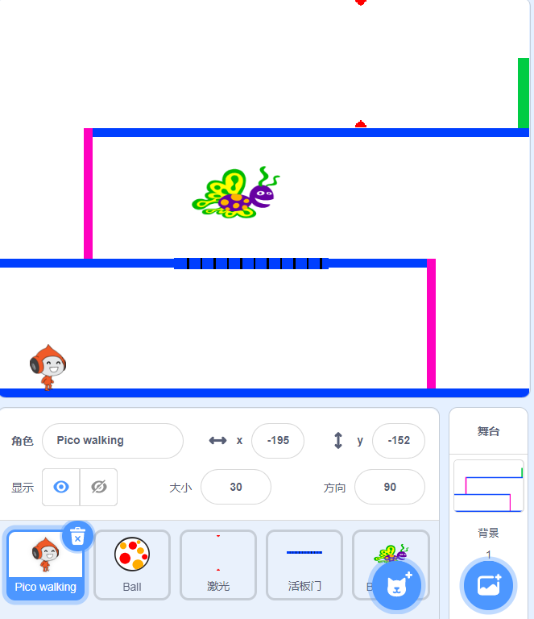

## 挑战：更多障碍

如果您认为您的游戏仍然太简单，则可以添加更多障碍。 障碍可以是您喜欢的任何东西！ 下面是一些建议：

+ 一只危险的蝴蝶
+ 出现和消失的平台
+ 掉落的网球



您甚至可以设计另一个背景来创建下一关。 然后添加代码，以便当您的角色到达绿色门时，游戏会切换到新的背景：


```blocks3
    if <touching color [#00FF00]?> then
		switch backdrop to (下一个背景 v)
		go to x: (-210) y: (-120)
		wait (1) seconds
	end
```