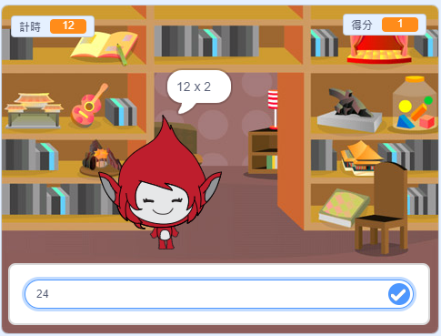

## 然後呢？

玩玩我們的[腦力遊戲](https://projects.raspberrypi.org/zh-TW/projects/brain-game?utm_source=pathway&utm_medium=whatnext&utm_campaign=projects)，這個專案裡你會學到怎麼創建一個數學測驗遊戲，看看在 30 秒內玩家可以答對幾題。

--- no-print ---

點擊按鈕開始。 輸入問題的答案，然後按下鍵盤的 <kbd>Enter</kbd> 按鍵。

  <iframe allowtransparency="true" width="485" height="402" src="https://scratch.mit.edu/projects/embed/250234955/?autostart=false" frameborder="0" scrolling="no"></iframe>
  

--- /no-print ---

--- print-only ---

--- /print-only ---

***
這個專案由以下志工翻譯：

Dnow Ba

Faye Yu

感謝志工們，我們才能為來自世界各地的人們提供學習機會。你也可以擔任翻譯志工，幫我們創造更多機會，若要進一步瞭解，請造訪 [rpf.io/translate](https://rpf.io/translate)。